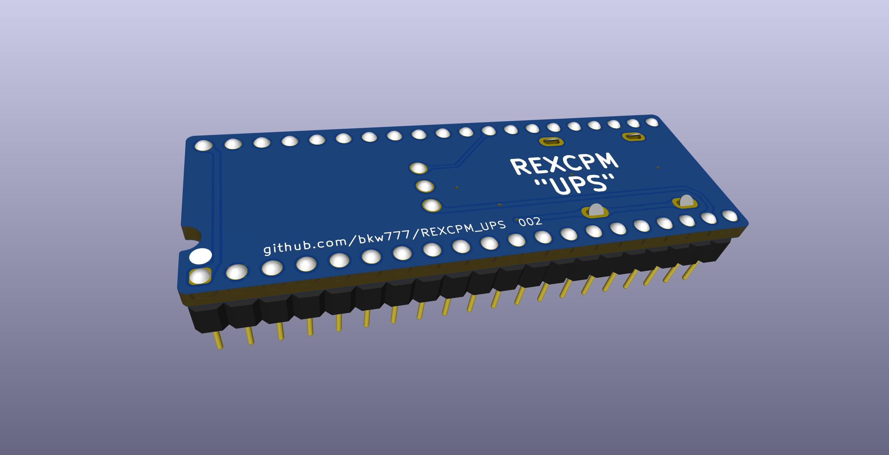
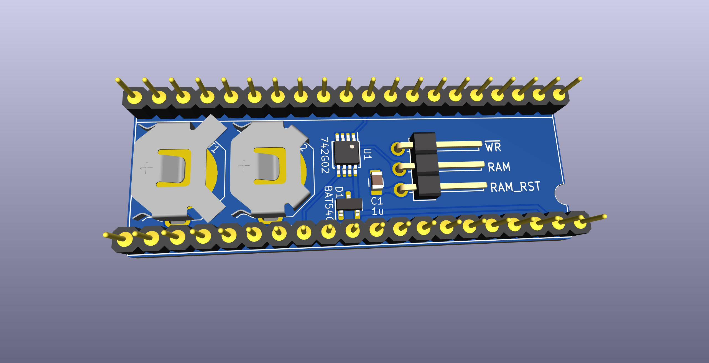
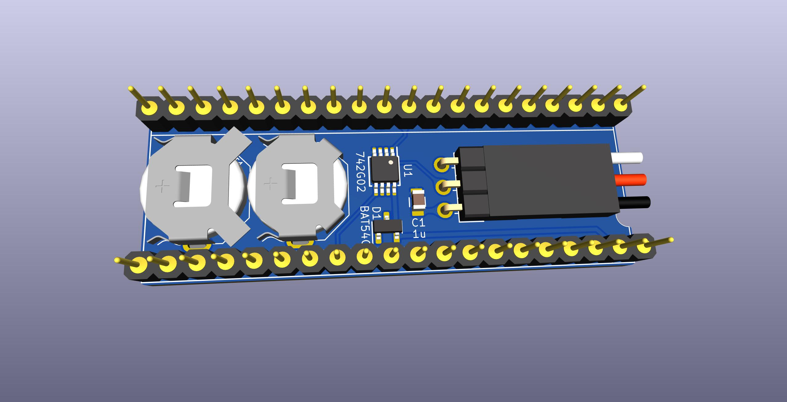
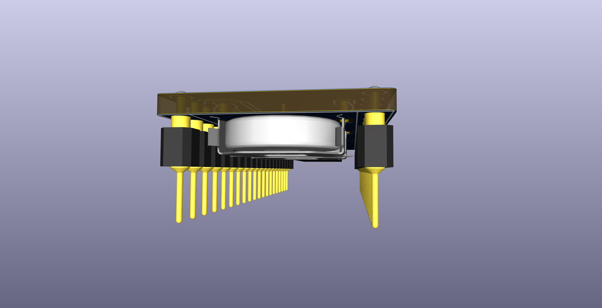
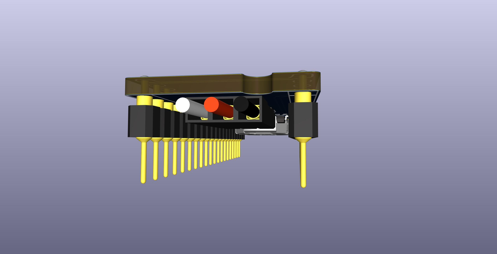
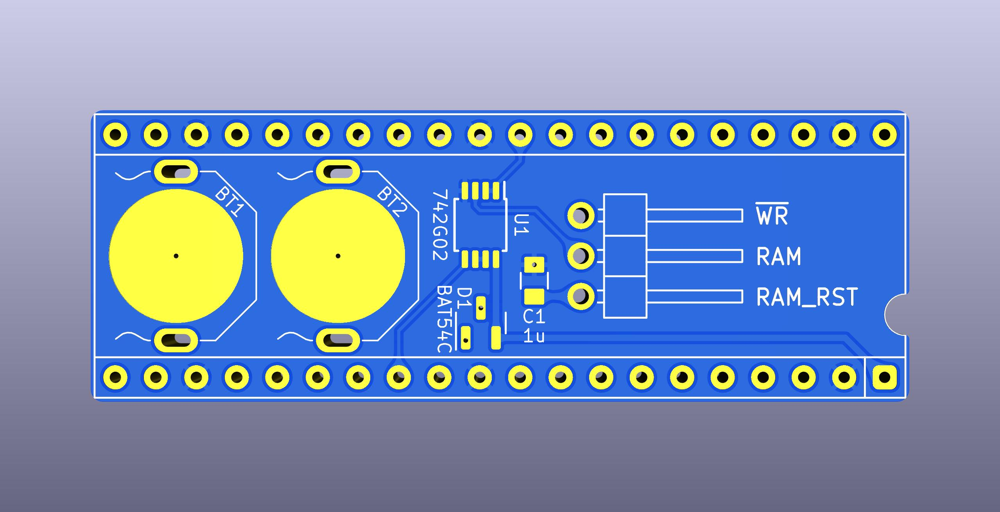
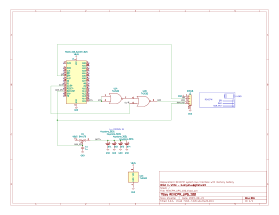
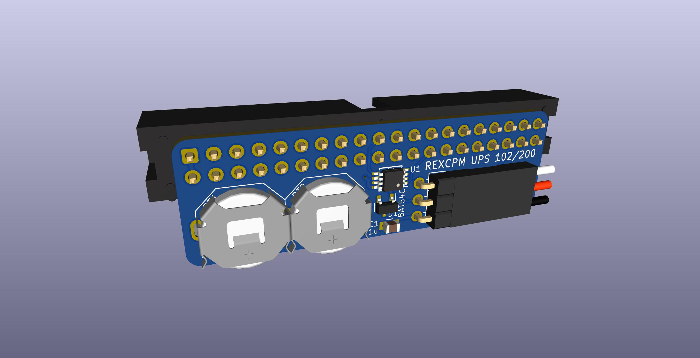
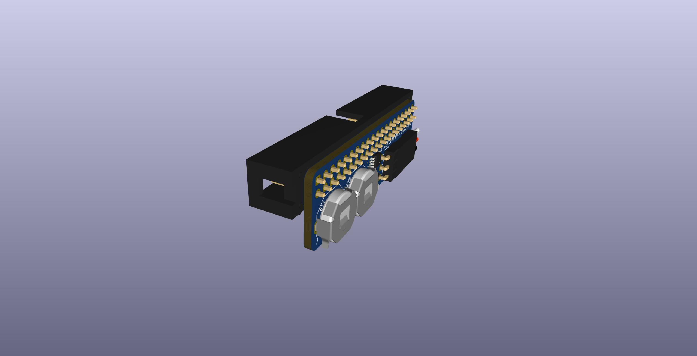

# REXCPM UPS
System bus interface board for [REXCPM](https://bitchin100.com/wiki/index.php?title=REXCPM) with on-board batteries.

** \*\*\* NOT YET TESTED \*\*\* **

## goals  
* battery to keep the REXCPM sram powered while out of the 100 or when the 100's batteries die  
* simpler more convenient standard round pins, simpler to repair  
* more robust all 40 pins instead of delicate single unsupported pins without neighbors  
* more pins -> more friction -> more secure installation  
  also the pins are fatter, which is ok in this case because the socket has round sockets not flat leaf type  
* parts on bottom in the space created by the tall shoulders of the standard pins  
* lower profile so that the board no longer pushes up on the compartment cover (the main REXCPM module needs this too but will not be so easy)  
* appearance, pin-1 notch matching the socket, etc

### status
One possible problem yet to be determined, might be something, might be nothing: The batteries need a diode to protect against charging. The original board from Steve has a 2-diode part with one of the diodes not used, so this design uses the same part and uses the previously un-used diode for the battery. But the original part is a Schottky type, and that might not be sufficient for protecting the battery.

## For TRS-80 Model 100
PCB <!-- [PCBWAY](https://www.pcbway.com/project/shareproject/)  --> (No fab link until the design is actually tested)  
BOM [DigiKey](https://www.digikey.com/short/5zrjvjpw)

## For TANDY Model 102 and 200

