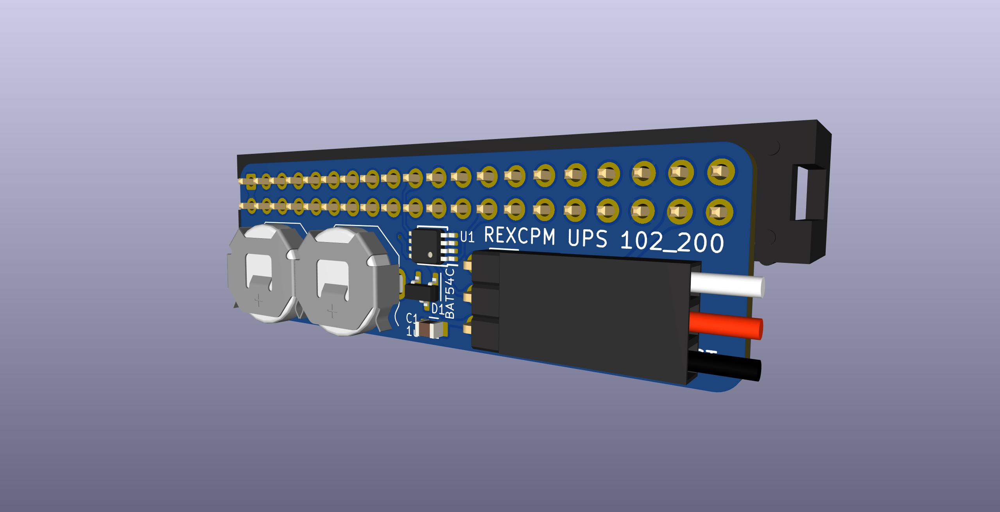
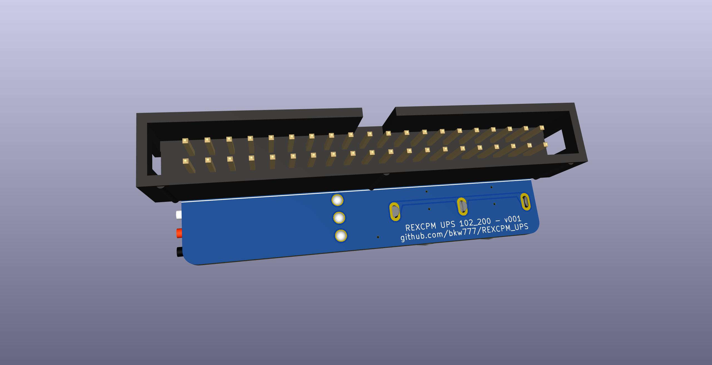
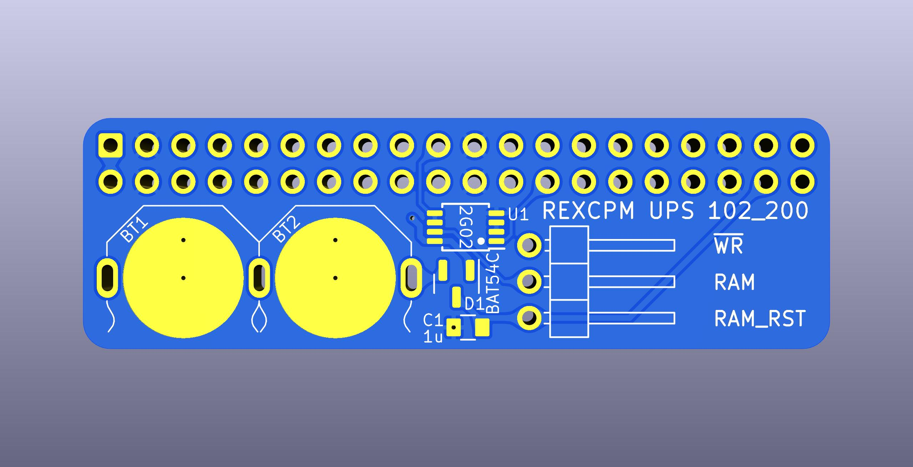
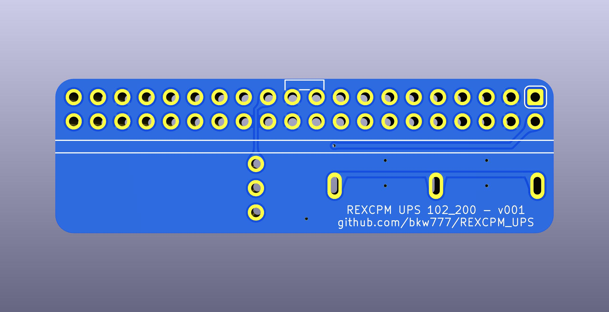
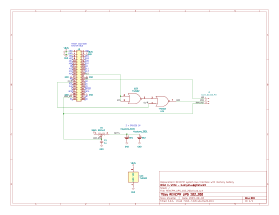

# REXCPM UPS
System bus interface board for [REXCPM](https://bitchin100.com/wiki/index.php?title=REXCPM) with on-board batteries.

## goals  
* battery to keep the REXCPM sram powered while out of the 100 or when the 100's batteries die  
* simpler more convenient standard round pins, simpler to repair  
* more robust all 40 pins instead of delicate single unsupported pins without neighbors  
* more pins -> more friction -> more secure installation  
  also the pins are fatter, which is ok in this case because the socket has round sockets not flat leaf type  
* parts on bottom in the space created by the tall shoulders of the standard pins  
* lower profile so that the board no longer pushes up on the compartment cover (the main REXCPM module needs this too but will not be so easy)  
* appearance, pin-1 notch matching the socket, etc

### status
Both versions tested and working, but the batteries don't last long enough to be worth it.

There is no proper ground path back from the rexcpm, but it is leaking back through the other signals somehow.

With new batteries at 3.2v, and the rexcpm and bus board removed from the 100, the big cap on the rexcpm starts at 4.7v, drains down to 2.5v over 15 minutes, then stays at 2.5v, and then loses another 0.2v over 24 hours. At that rate, the rexcpm memory will only last about 2 to 3 days on it's own.

## For TRS-80 Model 100

PCB <!-- [PCBWAY](https://www.pcbway.com/project/shareproject/)  --> (No fab link until the design is actually tested)  
BOM [DigiKey](https://www.digikey.com/short/5zrjvjpw)  

## For TANDY Model 102 and 200

PCB <!-- [PCBWAY](https://www.pcbway.com/project/shareproject/)  --> (No fab link until the design is actually tested)  
BOM [DigiKey](https://www.digikey.com/short/90wmmfhv)  

