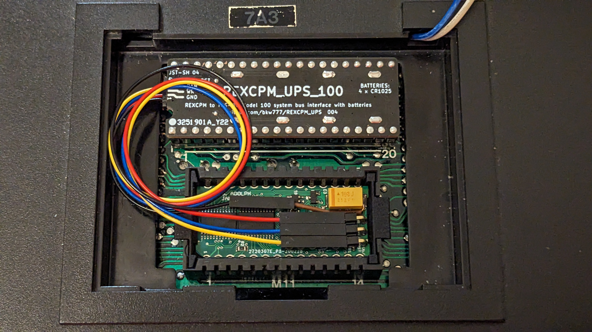
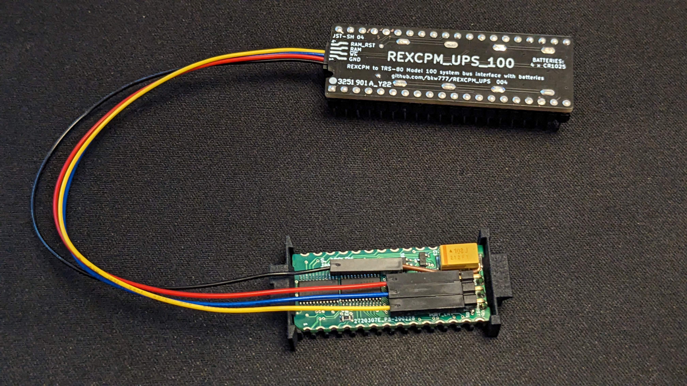
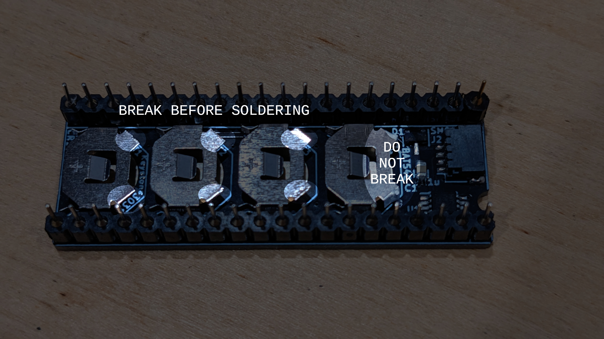
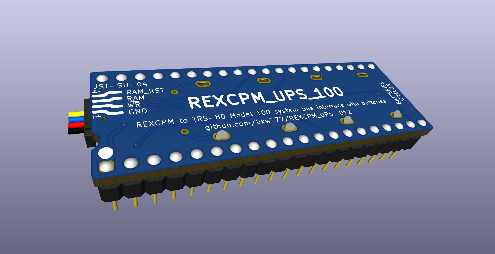
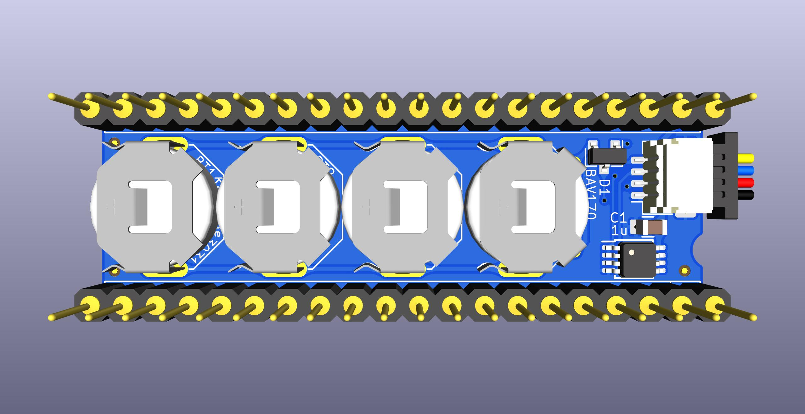
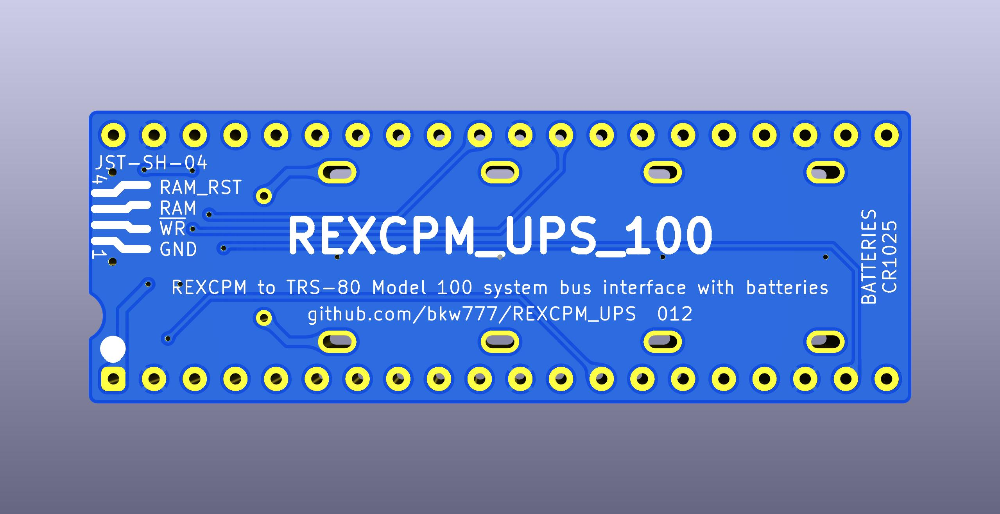
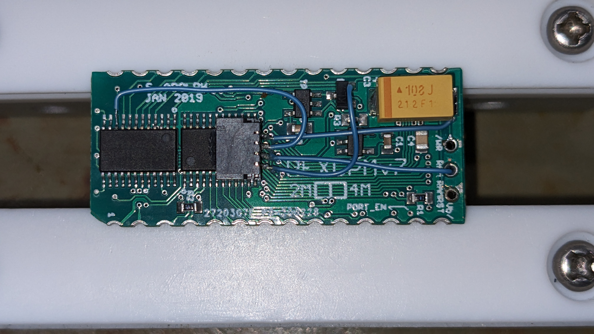

# REXCPM UPS
System bus interface board for [REXCPM](https://bitchin100.com/wiki/index.php?title=REXCPM) with on-board batteries.

* Provides an on-board battery to preserve the contents of the REXCPM while not installed in a computer, or after the computers memory battery dies, or when the memory power switch is turned off.
* Allows using REXCPM on model 102 and 200 without modifying the computer.

PCB for Model 100 [PCBWAY](https://www.pcbway.com/project/shareproject/Batteries_for_REXCPM_331c0add.html)  
BOM for Model 100 [DigiKey](https://www.digikey.com/short/dnn9hqhb)  

<!-- PCB for TANDY 102 & 200 [PCBWAY]()-->  
BOM for TANDY 102 & 200 [DigiKey](https://www.digikey.com/short/35h9821f)  

Not in the BOM, you will also optionally need about 2 inches or 50mm of 21-24awg (0.7-0.5mm) insulated solid wire. (solid core ethernet cable is typically 23awg) Thicker is better than thinner. 25mm will be used as a pin that a female dupont connector will go on to. 25mm will be used as mechanical strengthening for one of the battery holders.

## For TRS-80 Model 100

### Assembly Notes

Break the two rear walls off of 3 of the battery holders, so that a battery can pass all the way through the battery holder. The alloy that the battery holders are made of is brittle. When you try to bend the tabs up with pliers, they break off pretty clean right at the bend. Leave one battery holder intact. Install the open holders in BT1-BT3, install the intact holder in BT4.

Optional: There are two exposed vias at the rear of the BT4 footprint. These are for optional added mechanical reinforcenment of the rear walls of the last battery holder, since it takes a fair amount of force to push in all 4 batteries. It's not needed, but you can optionally solder 2 short bits of solid wire from those vias to the rear walls of the battery holder.

After soldering the pins and battery holders, flush-cut everything on the top surface as flush to the pcb as you can, both the dip pins and the battery holders, then add flux and touch each cut post again to reflow them into smooth, flat domes.

### GND Pin Mod

Add a 4th pin to the REXCPM for GND.

This is optional but easy and recommended for longest battery life while the REXCPM is not installed in a computer.

First, warning: While working and handling the REXCPM in general, be very careful not to put any sideways strain on the 3 pins. The vias that the pins are soldered into break free and rotate very easily, and breaks the connections to their traces. This has nothing to do with this mod. This can happen any time to any REXCPM, but while doing this work you are more likely to push sideways on the pins than when simply installing the original jumper cable.  
If this happens the situation is still salvagable, see below for the qwiic connector mod.

Cut a 25mm length of 23awg (0.6mm) solid insulated wire.  
Strip 3mm from one end and bend it 90 degrees.  
Strip 6mm from the the other end.  
Remove the REXCPM from the plastic carrier.  
Insert the straight end of the wire between the large yellow capacitor and the 3 pins (not over top of the cap, it must be to the side and below the top surface of the cap), with the short, bent end laying on the rear end of the big cap (the end without the stripe, at the rear end of the pcb), and the long/straight end pointing forward like the 3 pins, but further forward.  
Solder the wire to the capacitor.  

### Installation
Connect the 4 female Dupont wires to the REXCPM like this:

black  (GND)     ->  gnd pin mod  
red    (/WR)     ->  pin closest to cap  
blue   (RAM)     ->  middle pin  
yellow (RAM_RST) ->  pin furthest from cap

Make sure the GND wire is bent a little away from the other 3 pins so that the GND wire does not press against the side the nearest pin. When all 4 wires are connected, the 3 pins connectors should touch each other, but the GND wire should not touch the other 3. This is just to ensure the gnd wire can not be pressing sideways on the pins at all.

If you did not do the gnd pin mod, then just leave the black wire unconnected to anything. In this case, the batteries will still retain the REXCPM memory when the computers memory battery dies or the memory switch is turned off, but if the REXCPM is removed from the computer, the memory in the REXCPM may only last a few days. (it may last longer, the time is not known)

While the REXCPM is installed in the computer there is a GND connection between the 2 boards through the computer, and the additional GND wire doesn't make any difference, and not having it doesn't hurt.

While the REXCPM is removed from the computer, there is no proper GND connection between the 2 boards, but there is a backfeed leak via the RAM wire, and the REXCPM still gets enough power from the batteries to keep the memory alive. However it is not a good connection and the REXCPM memory will not be preserved for as long this way. The exact life time is not known yet, but may be as little as a few days. If you want to be able to remove the REXCPM without counting the hours, you should install the GND pin. If you will leave the REXCPM installed most of the time, and just want the "UPS" to cover when the computers internal battery dies or is turned off, then the extra GND connection isn't strictly needed. You can even still remove the REXCPM, just not for 2 years.

With 4 new batteries installed and the optional GND wire installed (or with the REXCPM always installed in the computer) then the REXCPM memory should last at least 2 years after the computers internal memory battery dies. This is just an estimate based on measured current drain and the rated capacity of the batteries.

The 4 batteries are connected in parallel. You don't have to install all 4 battery holders and don't have to install all 4 batteries. You can install as little as a single battery. You just get more or less shelf life. Each button cell provides about 6 months of memory retention, estimated. This is in addition to the computers internal battery which can last anywhere from a few weeks to several months. The "clock" on the button cell batteries doesn't start counting until the computers internal memory battery dies.

## For TANDY Model 102 and 200

Assembly notes:

The polarity notch in the 40-pin connector points AWAY from the batteries. The PCB hangs *down* from the connector when installed on the computer.

After installing the battery holders, flush-cut the solder tabs, add flux to the cut tabs, lay the board battery-side down on the work surface and press down in the center of the pcb with a spudger stick or bamboo skewer, and reflow the cut tabs into smooth flat domes.

## goals  
* battery to keep the REXCPM sram powered while out of the 100 or when the 100's batteries die  
* simpler more convenient standard round pins, simpler to repair  
* more robust all 40 pins instead of delicate single unsupported pins without neighbors  
* more pins -> more friction -> more secure installation  
  also the pins are fatter -> more friction, which is ok in this case because the socket has round pin sockets not flat leaf type  
* parts on bottom in the space created by the tall shoulders of the generic pin headers  
* appearance, pin-1 notch matching the socket, etc

### status

Latest revision with qwiic connector is good for the Model 100 version, but not as convenient for the 102/200 version, because there is not a pre-made cable with dupont sockets that's long enough.  
You would have to add 4 short male-female dupont extensions, which is ok but not ideal.

Go to the end of this photo album for the latest pics.  
https://photos.app.goo.gl/i87E4wzimexCR3wL6

## qwiic mod

This is not really practical because of how tiny the wires and solder points are, but the traces to the original pins on my REXCPM broke so I had to do some sort of repair with bodge wires anyway, so, IF you wanted to and are up to the fine soldering, then here are the connections to install a "qwiic" connector (JST-SH 04 male horizontal smt) onto the REXCPM.

The qwiic connector is one of the black ones like Adafruit or SparkFun has instead of the natural colored ones Digikey and Mouser has,  
https://www.sparkfun.com/products/14417  
to hopefully stick better to the glue. The material feels different and also feels like it has glass filler so it has more texture, especially when scraped with a knife or sanded. I scuffed the bottom surface before gluing.  
The connector is glued bottom-down (pins down, as if soldering to a pcb) on top of one of the 4245 chips with super-glue, with the pins hanging off the edge of the chip in free air. This way the pins are at no risk of touching anything on the pcb, and the cable connector is unobstructed for inserting & removing.

The wire is 30awg wire-wrapping wire. You could use any fine gauge solid insulated wire like winding wire.

The height of the connector ends up exactly the same height as the top of the big capacitor, and does fit under the compartment door.

This is all very tiny to solder correctly, and somewhat fragile when done, and I do not propose this as a convenient practical way to use the battery board for most people.

It does have a few good points though if you do manage to do it.  
* The connection becomes fully polarity protected on both ends.  
* The shortest 50mm (2 inch) qwiic cable is usable on Model 100 which is neater easier than the 150mm dupont breakout cable.  
* The Model 102 & 200 become simple and convenient to use, since there is no pre-made dupont breakout cable long enough to connect to the original pins the way the 100 does, but there are pre-made qwiic or JST cables that are long enough.

In Model 100  

In Model 102  

In Model 200  

