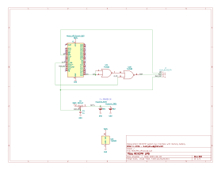

# REXCPM UPS
A replacement Model 100 system bus board for REXCPM with on-board batteries.

** \*\*\* NOT YET TESTED \*\*\* **

## goals  
* battery to keep the REXCPM sram powered while out of the 100 or when the 100's batteries die  
* simpler more convenient standard round pins, simpler to repair  
* more robust all 40 pins instead of delicate single unsupported pins without neighbors  
* more pins -> more friction -> more secure installation  
  also the pins are fatter, which is ok in this case because the socket has round sockets not flat leaf type  
* parts on bottom in the space created by the tall shoulders of the standard pins  
* lower profile so that the board no longer pushes up on the compartment cover (the main REXCPM module needs this too but will not be so easy)  
* appearance, pin-1 notch matching the socket, etc

## schematic & pcb

(No pcb fab link until the design is actually tested)
<!--
PCB [PCBWAY](https://www.pcbway.com/project/shareproject/)  
BOM [DigiKey](https://www.digikey.com/short/)
-->
