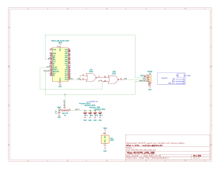

# REXCPM UPS
System bus interface board for [REXCPM](https://bitchin100.com/wiki/index.php?title=REXCPM) with on-board batteries.

## For TRS-80 Model 100

<!-- PCB [PCBWAY](https://www.pcbway.com/project/shareproject/)  -->
BOM [DigiKey](https://www.digikey.com/short/dnn9hqhb)  

### Assembly Notes

Break the two rear walls off of 3 of the battery holders, so that a battery can pass all the way through the battery holder. The alloy that the battery holders are made of is brittle. If you try to fold the tabs up with pliers, they break right off clean right at the bend.

Optionally straighten the solder tabs on the battery holders before trying to install. If part of the tab breaks when you straighten it, it doesn't matter since you are going to flush-cut it after soldering anyway.  

Leave 1 battery holder intact. Install the intact battery holder closest to the connector end (location BT4).

Do the battery holders before doing the DIP pins, so that you can lay the board upside down on the work surface and push down in the center of thr pcb with a spudger, to hold all 4 battery holders fully inserted, even, and flat while soldering.

There are two exposed vias at the rear of the BT4 footprint. These are for optional added mechanical reinforcenment of the rear walls of the last battery holder, since it takes a fair amount of force to push in all 4 batteries. It's not needed, but you can optionally solder 2 short bits of solid wire from those vias to the rear wall of the battery holder.

After soldering the pins and battery holders, flush-cut everything on the top surface as flush to the pcb as you can, both the dip pins and the battery holders, then add flux and touch each cut post again to reflow them into smooth, flat domes.

Optional modification to the REXCPM (at own risk obviously):
First, warning: be very careful not to put any sideways strain on the 3 pins on the REXCPM while handling. The vias that the pins are soldered in to are weak and the pins break free and rotate very easily, and when they do, it breaks the connection to the very thin traces going to those pins. This has nothing to do with this mod. This can happen any time to any REXCPM using only the original parts.

Take a 25mm length of 23 gauge solid core wire (such as from some solid core ethernet cable, thermostat wire, doorbell wire, etc.).  
Strip 3mm from one end and bend it 90 degrees.  
Strip 6mm from the the other end.  
Remove the REXCPM from the plastic carrier.  
Insert the straight end of the wire between the large yellow capacitor and the 3 pins, with the short, bent end laying on the rear end of the big cap (the end without the stripe, at the rear end of the pcb), and the long/straight end pointing forward parallel to the 3 pins, sticking further foward than the 3 pins.  
Solder the wire to the capacitor.  

### Installation
Connect the 4 female Dupont wires to the REXCPM like this:

black  (GND)     ->  wire on cap
red    (/WR)     ->  pin closest to cap
blue   (RAM)     ->  middle pin
yellow (RAM_RST) ->  pin furthest from cap

Make sure the GND wire is bent a little away from the other 3 pins so that the GND wire does not press against the side the nearest pin at all. When all 4 wires are connected, the 3 pins connectors should touch each other, but the GND wire should not touch the other 3. This is to avoid risking the pins rotating and breaking the PCB traces that connect to them.

If you did not install the GND wire on the cap, just leave the black wire unconnected to anything. In this case, the batteries will still retain the REXCPM memory, but not for as long while the REXCPM is removed from the computer. While the REXCPM is installed in the computer there is a GND connection between the 2 boards through the computer, and the additional GND wire doesn't make any difference. While the REXCPM is removed from the computer, there is no proper GND connection between the 2 boards, but there is a "backfeed" or "leak" via the RAM wire, and the REXCPM still gets enough power from the batteries to keep the memory alive. However it is not a good connection and the REXCPM memory will not be preserved for as long this way. The exact life time is not known yet, but may be as little asa few days. If you will remove the REXCPM for more than a few days, you should install the GND wire. If you will leave the REXCPM installed most of the time, and just want the "ups" to cover when the 100's internal battery dies on the shelf, the extra GND wire isn't strictly needed.

With 4 new batteries installed and the optional GND wire installed (or with the REXCPM always installed in the Model 100 which also provides a GND connection) then the REXCPM memory should last at least 2 years after the Model 100's internal memory battery dies. This is just an estimate based on measured current drain and the rated capacity of the batteries.

The 4 batteries are connected in parallel. You don't have to install all 4 battery holders and don't have to install all 4 batteries. You can install as little as a single battery or 2 or 3 or 4. You just get more or less shelf life. Each button cell equates to about 6 months of protection, estimated. This is in addition to the 100's internal battery. The "clock" doesn't start counting until the 100's internal memory battery dies.

## For TANDY Model 102 and 200

<!-- PCB [PCBWAY](https://www.pcbway.com/project/shareproject/)  -->
BOM [DigiKey](https://www.digikey.com/short/35h9821f)  

Assembly notes:

The polarity notch in the 40-pin connector points AWAY from the batteries. The PCB hangs *down* from the connector when installed on the computer.

After installing the battery holders, flush-cut the solder tabs, add flux to the cut tabs, lay the board battery-side down on the work surface and press down in the center of the pcb with a spudger stick or bamboo skewer, and reflow the cut tabs into smooth flat domes.

## goals  
* battery to keep the REXCPM sram powered while out of the 100 or when the 100's batteries die  
* simpler more convenient standard round pins, simpler to repair  
* more robust all 40 pins instead of delicate single unsupported pins without neighbors  
* more pins -> more friction -> more secure installation  
  also the pins are fatter -> more friction, which is ok in this case because the socket has round pin sockets not flat leaf type  
* parts on bottom in the space created by the tall shoulders of the generic pin headers  
* appearance, pin-1 notch matching the socket, etc

### status

Latest revision with qwiic connector is good for the Model 100 version, but not as convenient for the 102/200 version, because there is not a pre-made cable with dupont sockets that's long enough.  
You would have to add 4 short male-female dupont extensions, which is ok but not ideal.

Go to the end of this photo album for the latest pics.  
https://photos.app.goo.gl/i87E4wzimexCR3wL6
