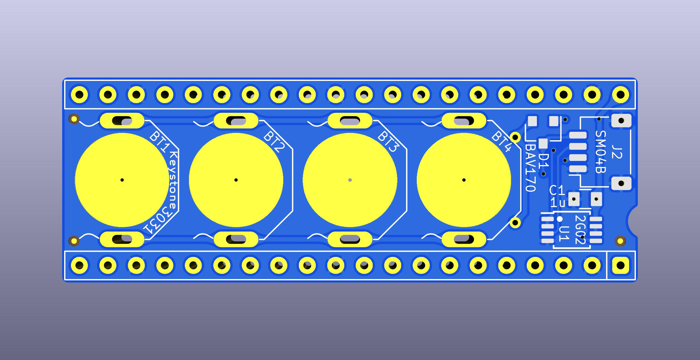

# REXCPM UPS
System bus interface board for [REXCPM](https://bitchin100.com/wiki/index.php?title=REXCPM) with on-board batteries.

## goals  
* battery to keep the REXCPM sram powered while out of the 100 or when the 100's batteries die  
* simpler more convenient standard round pins, simpler to repair  
* more robust all 40 pins instead of delicate single unsupported pins without neighbors  
* more pins -> more friction -> more secure installation  
  also the pins are fatter -> more friction, which is ok in this case because the socket has round pin sockets not flat leaf type  
* parts on bottom in the space created by the tall shoulders of the generic pin headers  
* appearance, pin-1 notch matching the socket, etc

### status

Latest revision with qwiic connector is good for the Model 100 version, but not as convenient for the 102/200 version, because there is not a pre-made cable with dupont sockets that's long enough.  
You would have to add 4 short male-female dupont extensions, which is ok but not ideal.

Go to the end of this photo album for the latest pics.  
https://photos.app.goo.gl/i87E4wzimexCR3wL6

## For TRS-80 Model 100

<!-- PCB [PCBWAY](https://www.pcbway.com/project/shareproject/)  -->
BOM [DigiKey](https://www.digikey.com/short/dnn9hqhb)  

Assembly notes:

Break the two rear walls off of 3 of the battery holders, so that a battery can pass all the way through the battery holder. The alloy that the battery holders are made of is brittle. If you try to fold the tabs up with pliers, they break right off clean right at the bend.

Optionally straighten the solder tabs on the battery holders before trying to install. If part of the tab breaks when you straighten it, it doesn't matter since you are going to flush-cut it after soldering anyway.  

Leave 1 battery holder intact. Install the intact battery holder closest to the connector end (location BT4).

Do the battery holders before doing the DIP pins, so that you can lay the board upside down on the work surface and push down in the center of thr pcb with a spudger, to hold all 4 battery holders fully inserted, even, and flat while soldering.

There are two exposed vias at the rear of the BT4 footprint. These are for optional added mechanical reinforcenment of the rear walls of the last battery holder, since it takes a fair amount of force to push in all 4 batteries. It's not needed, but you can optionally solder 2 short bits of solid wire from those vias to the rear wall of the battery holder.

After soldering the pins and battery holders, flush-cut everything on the top surface as flush to the pcb as you can, both the dip pins and the battery holders, then add flux and touch each cut post again to reflow them into smooth, flat domes.

## For TANDY Model 102 and 200

<!-- PCB [PCBWAY](https://www.pcbway.com/project/shareproject/)  -->
BOM [DigiKey](https://www.digikey.com/short/35h9821f)  

Assembly notes:

The polarity notch in the 40-pin connector points AWAY from the batteries. The PCB hangs *down* from the connector when installed on the computer.

After installing the battery holders, flush-cut the solder tabs, add flux to the cut tabs, lay the board battery-side down on the work surface and press down in the center of the pcb with a spudger stick or bamboo skewer, and reflow the cut tabs into smooth flat domes.

